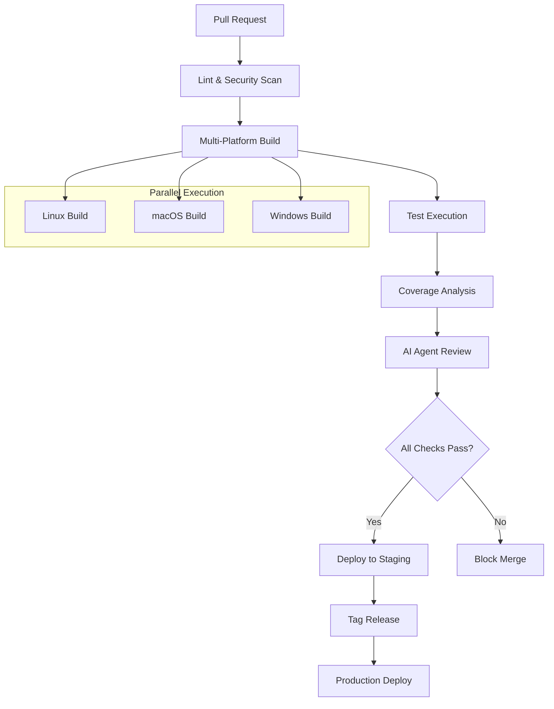

# Transcendent
*The Universal Enterprise Software Development Template*


**Transcendent** is the next-generation starter template for enterprise software development, combining Bazel's hermetic build system with AI-driven automation and containerized workflows. Designed to be cloned for every new project in your organization, it enforces modern engineering practices while accelerating development through autonomous agents that handle code generation, testing, documentation, and dependency management.

## 🚀 Key Features

### ✅ **Core Build Features**
- Hermetic, reproducible builds with Bazel
- Polyglot support: C++, Python, Java, Groovy
- Maven-like lifecycle commands
- Remote execution and caching
- Cross-platform compatibility

### 🤖 **AI Automation Capabilities**
- Six specialized autonomous agents
- Comment-triggered activation (`/agent generate tests`)
- Auto-generated code, tests, and documentation
- Intelligent dependency management
- Security and compliance enforcement

### 🐳 **Container/Docker Features**
- Docker Compose development environment
- Containerized CI/CD pipelines
- Local LLM inference support
- Isolated sandboxed execution

### 🔧 **Developer Tooling**
- Deep VSCode integration
- Pre-configured language servers
- Remote debugging support
- Extensible plugin architecture

## 📋 Technical Specifications

| Component | Technology | Purpose |
|-----------|------------|---------|
| **Build System** | Bazel | Hermetic, scalable, polyglot builds |
| **Languages** | C++, Python, Java, Groovy | Multi-language project support |
| **CI/CD** | GitHub Actions, GitLab CI | Cross-platform pipeline execution |
| **Containerization** | Docker, Docker Compose | Development environment isolation |
| **AI Integration** | Ollama, vLLM, CodeLlama, Mistral | Local LLM inference and automation |
| **IDE** | VSCode | Integrated development experience |
| **Package Management** | Bazel WORKSPACE, Maven, pip | Unified dependency resolution |
| **Testing** | Bazel test, JUnit, pytest | Automated test generation and execution |
| **Documentation** | Markdown, Mermaid | Auto-generated technical documentation |

## ⚡ Quick Start

### 1. Clone the Repository
```bash
git clone https://github.com/doevelopper/transcendent.git
cd transcendent
```

### 2. Local Environment Setup
```bash
# Start containerized development environment
docker-compose up -d

# Verify Docker services
docker-compose ps
```

### 3. Initial Build Verification
```bash
# Build all targets
bazel build //...

# Run all tests
bazel test //...

# Verify installation
bazel run //:install
```

### 4. AI Agent Configuration
```bash
# Configure AI agents (one-time setup)
cp .env.example .env
# Edit .env with your LLM preferences

# Test agent connectivity
bazel run //tools:test-agents
```

## 🤖 AI Agent Usage

### Available Agents

| Agent | Command | Function |
|-------|---------|----------|
| **coder** | `/agent code <spec>` | Generates production code from specifications |
| **reviewer** | `/agent review` | Enforces linting, security, architecture compliance |
| **tester** | `/agent test <target>` | Auto-generates unit/integration tests |
| **docwriter** | `/agent docs` | Updates README, API docs, diagrams |
| **depmanager** | `/agent deps update` | Maintains dependency files |
| **custom** | `/agent custom <task>` | Extensible for team-specific needs |

### Sample Agent Interaction

```bash
# Comment in GitHub/GitLab PR:
/agent generate tests for //src/core:calculator

# Agent Response:
# ✅ Generated 12 test cases for Calculator class
# ✅ Added integration tests for edge cases
# ✅ Updated BUILD files with test dependencies
# 📊 Test coverage: 94% (+15%)
```

### Configuration Customization

```yaml
# .transcendent/agents.yml
agents:
  coder:
    model: "codellama:13b"
    temperature: 0.1
    max_tokens: 2048
  tester:
    frameworks: ["junit", "pytest", "googletest"]
    coverage_threshold: 85
```

## 🔄 CI/CD Pipeline

### Workflow Overview



### Pipeline Stages

#### GitHub Actions & GitLab CI (Identical Logic)

1. **Pre-flight Checks**
   - Code linting (clang-format, black, checkstyle)
   - Security scanning (CodeQL, dependency audit)
   - License compliance verification

2. **Build Matrix**
   - Linux (Ubuntu 22.04)
   - macOS (latest)
   - Windows Server 2022

3. **Testing**
   - Unit tests: `bazel test //...`
   - Integration tests: `bazel test //integration/...`
   - Performance benchmarks

4. **Quality Gates**
   - Code coverage ≥85%
   - Security vulnerability scan
   - AI agent compliance review

5. **Deployment**
   - Staging: Automatic on develop branch
   - Production: Tag-triggered releases

## 🛠️ Development Setup

### VSCode Configuration

1. **Install Required Extensions**
```bash
# Automated extension installation
./scripts/setup-vscode.sh
```

Required extensions:
- Bazel (Google)
- C/C++ (Microsoft)
- Python (Microsoft)
- Java Extension Pack
- GitLens

2. **Bazel Plugin Setup**
```json
// .vscode/settings.json
{
  "bazel.buildifierFixOnFormat": true,
  "bazel.queriesShareServer": true,
  "bazel.buildifierExecutable": "/usr/local/bin/buildifier"
}
```

3. **Language Server Configuration**
```bash
# Generate compile_commands.json for C++
bazel run //:refresh_compile_commands

# Configure Python path
bazel run //tools:setup-python-path
```

4. **Debug Environment**
```json
// .vscode/launch.json
{
  "type": "lldb",
  "request": "launch",
  "program": "${workspaceFolder}/bazel-bin/src/main/app",
  "preLaunchTask": "bazel-build-debug"
}
```

### Troubleshooting

| Issue | Solution |
|-------|----------|
| Bazel build fails | Run `bazel clean --expunge` and rebuild |
| Language server not working | Regenerate compile commands |
| Tests timeout | Increase timeout in `.bazelrc` |
| Docker issues | Check disk space and restart Docker |

## 📦 Artifact Publishing

### Bazel Publishing Workflow

```bash
# Complete Maven-like lifecycle
bazel build //...          # compile
bazel test //...           # test
bazel run //:package       # package
bazel run //:install       # install to local repository
bazel run //:publish       # deploy to remote repository
```

### Java/Groovy Library Publishing

```python
# BUILD file configuration
java_library(
    name = "my-library",
    srcs = glob(["src/main/java/**/*.java"]),
    visibility = ["//visibility:public"],
    deps = ["@maven//:junit_junit"],
)

maven_publish(
    name = "publish",
    coordinates = "com.example:my-library:1.0.0",
    pom_template = "pom.xml.template",
    targets = [":my-library"],
)
```

### Version Management

```bash
# Semantic versioning automation
./scripts/version-bump.sh major|minor|patch

# Example: Bump minor version
./scripts/version-bump.sh minor
# 1.2.3 → 1.3.0
```

### Repository Configuration

```yaml
# .transcendent/publishing.yml
repositories:
  snapshots:
    url: "https://nexus.company.com/repository/maven-snapshots/"
    credentials: "NEXUS_CREDENTIALS"
  releases:
    url: "https://nexus.company.com/repository/maven-releases/"
    credentials: "NEXUS_CREDENTIALS"
```

## 🔧 Extensibility Guide

### Adding New Programming Languages

1. **Update WORKSPACE**
```python
# WORKSPACE
load("@bazel_tools//tools/build_defs/repo:http.bzl", "http_archive")

# Add language rules (example: Rust)
http_archive(
    name = "rules_rust",
    sha256 = "...",
    urls = ["https://github.com/bazelbuild/rules_rust/releases/..."],
)

load("@rules_rust//rust:repositories.bzl", "rules_rust_dependencies", "rust_register_toolchains")
rules_rust_dependencies()
rust_register_toolchains()
```

2. **Configure Language Server**
```bash
# Add to scripts/setup-language-servers.sh
install_rust_analyzer() {
    rustup component add rust-analyzer
}
```

3. **Update CI Pipeline**
```yaml
# .github/workflows/ci.yml
- name: Setup Rust
  uses: actions-rs/toolchain@v1
  with:
    toolchain: stable
```

### Creating Custom AI Agents

1. **Agent Definition**
```python
# agents/custom_agent.py
from transcendent.agents import BaseAgent

class CustomAgent(BaseAgent):
    def __init__(self, config):
        super().__init__(config)
        self.name = "custom"
    
    def process_command(self, command, context):
        # Implementation
        pass
```

2. **Register Agent**
```yaml
# .transcendent/agents.yml
agents:
  custom:
    class: "agents.custom_agent.CustomAgent"
    triggers: ["/agent custom"]
    model: "codellama:7b"
```

3. **Integration Test**
```bash
bazel test //agents:custom_agent_test
```

### Integrating Additional Tools

```python
# tools/integrations/new_tool.py
def integrate_new_tool():
    # Tool-specific integration logic
    pass

# Register in tools/BUILD
py_binary(
    name = "integrate_new_tool",
    srcs = ["integrations/new_tool.py"],
    deps = ["//tools:integration_framework"],
)
```

## 📄 Project Information

### License
This project is licensed under the MIT License - see the [LICENSE](LICENSE) file for details.

### Contributing
1. Fork the repository
2. Create a feature branch (`git checkout -b feature/amazing-feature`)
3. Commit your changes (`git commit -m 'Add amazing feature'`)
4. Push to the branch (`git push origin feature/amazing-feature`)
5. Open a Pull Request

### Support & Contact
- **Issues**: [GitHub Issues](https://github.com/doevelopper/transcendent/issues)
- **Discussions**: [GitHub Discussions](https://github.com/doevelopper/transcendent/discussions)
- **Documentation**: [Project Wiki](https://github.com/doevelopper/transcendent/wiki)
- **Email**: support@transcendent.dev

### Performance Considerations
- **Build Times**: Bazel remote caching reduces build times by 60-80%
- **Memory Usage**: Typical development environment requires 8GB RAM minimum
- **Disk Space**: Allow 10GB for build cache and dependencies
- **Network**: Remote execution requires stable internet connection

### Security Best Practices
- All AI agent executions are sandboxed and isolated
- Dependency scanning integrated into CI/CD pipeline
- Secrets management via environment variables only
- Regular security updates through automated dependency management

---

> "This is not just a starter template — it's the foundation of an autonomous software factory."